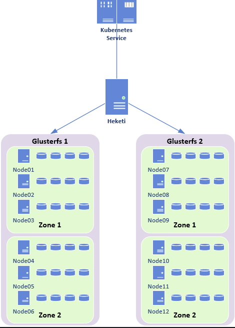
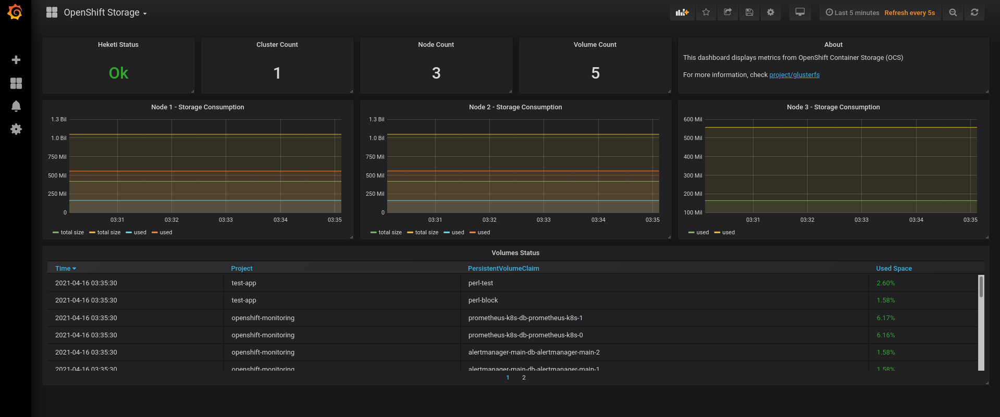

Glusterfs + OpenShift 3.11 
=================

### Correct way to turn OFF and turn OM each GlusterFS node

~~~~

[root@master001311 ~]# oc get nodes 
NAME                            STATUS    ROLES     AGE       VERSION
app001311.gquites.local         Ready     compute   2d        v1.11.0+d4cacc0
app002311.gquites.local         Ready     compute   2d        v1.11.0+d4cacc0
glusterfs001311.gquites.local   Ready     storage   2d        v1.11.0+d4cacc0
glusterfs002311.gquites.local   Ready     storage   2d        v1.11.0+d4cacc0
glusterfs003311.gquites.local   Ready     storage   2d        v1.11.0+d4cacc0
infra001311.gquites.local       Ready     infra     2d        v1.11.0+d4cacc0
master001311.gquites.local      Ready     master    2d        v1.11.0+d4cacc0

[root@master001311 ~]# ssh glusterfs001311.gquites.local poweroff 
Connection to glusterfs001311.gquites.local closed by remote host.

[root@master001311 ~]# oc get nodes
NAME                            STATUS     ROLES     AGE       VERSION
app001311.gquites.local         Ready      compute   2d        v1.11.0+d4cacc0
app002311.gquites.local         Ready      compute   2d        v1.11.0+d4cacc0
glusterfs001311.gquites.local   NotReady   storage   2d        v1.11.0+d4cacc0
glusterfs002311.gquites.local   Ready      storage   2d        v1.11.0+d4cacc0
glusterfs003311.gquites.local   Ready      storage   2d        v1.11.0+d4cacc0
infra001311.gquites.local       Ready      infra     2d        v1.11.0+d4cacc0
master001311.gquites.local      Ready      master    2d        v1.11.0+d4cacc0

[root@master001311 ~]# ssh glusterfs002311.gquites.local poweroff 
Connection to glusterfs002311.gquites.local closed by remote host.

[root@master001311 ~]# oc get nodes
NAME                            STATUS     ROLES     AGE       VERSION
app001311.gquites.local         Ready      compute   2d        v1.11.0+d4cacc0
app002311.gquites.local         Ready      compute   2d        v1.11.0+d4cacc0
glusterfs001311.gquites.local   Ready      storage   2d        v1.11.0+d4cacc0
glusterfs002311.gquites.local   NotReady   storage   2d        v1.11.0+d4cacc0
glusterfs003311.gquites.local   Ready      storage   2d        v1.11.0+d4cacc0
infra001311.gquites.local       Ready      infra     2d        v1.11.0+d4cacc0
master001311.gquites.local      Ready      master    2d        v1.11.0+d4cacc0

[root@master001311 ~]# ssh glusterfs003311.gquites.local poweroff 
Connection to glusterfs003311.gquites.local closed by remote host.

[root@master001311 ~]# oc get nodes
NAME                            STATUS     ROLES     AGE       VERSION
app001311.gquites.local         Ready      compute   2d        v1.11.0+d4cacc0
app002311.gquites.local         Ready      compute   2d        v1.11.0+d4cacc0
glusterfs001311.gquites.local   Ready      storage   2d        v1.11.0+d4cacc0
glusterfs002311.gquites.local   Ready      storage   2d        v1.11.0+d4cacc0
glusterfs003311.gquites.local   NotReady   storage   2d        v1.11.0+d4cacc0
infra001311.gquites.local       Ready      infra     2d        v1.11.0+d4cacc0
master001311.gquites.local      Ready      master    2d        v1.11.0+d4cacc0
~~~~

### Check the container logs:

~~~~
[root@master001311 ~]# oc get pods -o wide
NAME                                          READY     STATUS    RESTARTS   AGE       IP               NODE                            NOMINATED NODE
glusterblock-storage-provisioner-dc-1-smdvf   1/1       Running   1          2d        10.129.0.6       app002311.gquites.local         <none>
glusterfs-storage-grnsh                       1/1       Running   2          2d        192.168.123.26   glusterfs003311.gquites.local   <none>
glusterfs-storage-kwfwm                       1/1       Running   2          2d        192.168.123.25   glusterfs002311.gquites.local   <none>
glusterfs-storage-pl6xj                       1/1       Running   2          2d        192.168.123.24   glusterfs001311.gquites.local   <none>
heketi-storage-1-6c9nd                        1/1       Running   1          2d        10.129.2.34      infra001311.gquites.local       <none>

[root@master001311 ~]# oc logs glusterfs-storage-grnsh 
maximum number of pids configured in cgroups: 4096
maximum number of pids configured in cgroups (reconfigured): max
env variable is set. Update in gluster-blockd.service

~~~~

### Get the storage Class
~~~~
[root@master001311 ~]# oc describe storageclass glusterfs-storage 
Name:                  glusterfs-storage
IsDefaultClass:        No
Annotations:           <none>
Provisioner:           kubernetes.io/glusterfs
Parameters:            resturl=http://heketi-storage.app-storage.svc:8080,restuser=admin,secretName=heketi-storage-admin-secret,secretNamespace=app-storage
AllowVolumeExpansion:  <unset>
MountOptions:          <none>
ReclaimPolicy:         Delete
VolumeBindingMode:     Immediate
Events:                <none>
[root@master001311 ~]# 
~~~~
### Get Pod heketi
~~~~
[root@master001311 ~]# oc get pods --all-namespaces | grep -i heketi
app-storage                         heketi-storage-1-6c9nd                          1/1       Running     1          2d
~~~~
### Enter namespaces app-storage 
~~~~
[root@master001311 ~]# oc project app-storage 
Already on project "app-storage" on server "https://console311.gquites.local:8443"

[root@master001311 ~]# oc get pods -o wide
NAME                                          READY     STATUS    RESTARTS   AGE       IP               NODE                            NOMINATED NODE
glusterblock-storage-provisioner-dc-1-smdvf   1/1       Running   1          2d        10.129.0.6       app002311.gquites.local         <none>
glusterfs-storage-grnsh                       1/1       Running   2          2d        192.168.123.26   glusterfs003311.gquites.local   <none>
glusterfs-storage-kwfwm                       1/1       Running   2          2d        192.168.123.25   glusterfs002311.gquites.local   <none>
glusterfs-storage-pl6xj                       1/1       Running   2          2d        192.168.123.24   glusterfs001311.gquites.local   <none>
heketi-storage-1-6c9nd                        1/1       Running   1          2d        10.129.2.34      infra001311.gquites.local       <none>
~~~~

### Glusterfs is service in pods within hosts running as privileged.

~~~~
[root@master001311 ~]# oc describe pod glusterfs-storage-grnsh
Name:               glusterfs-storage-grnsh
Namespace:          app-storage
Priority:           0
PriorityClassName:  <none>
Node:               glusterfs003311.gquites.local/192.168.123.26
Start Time:         Tue, 13 Apr 2021 01:41:17 -0300
Labels:             controller-revision-hash=3550762903
                    glusterfs=storage-pod
                    glusterfs-node=pod
                    pod-template-generation=1
Annotations:        openshift.io/scc=privileged    # <<<<<<<<
Status:             Running
IP:                 192.168.123.26
Controlled By:      DaemonSet/glusterfs-storage
~~~~
### Openshift talks to heketi via API and heketi talks to glustefs container by commands.

### To log into the Container:
### To see all the settings of the heketi we use the commands below:

~~~~

[root@master001311 ~]# oc rsh heketi-storage-1-6c9nd 
sh-4.2# heketi-cli topology info 

 Cluster Id: 2d9ea18ee5cf3c32436f46b89f82b97c

    File:  true     
    Block: true   

    Volumes:

	Name: heketidbstorage
	Size: 2
	Id: 944001a27869e55bcbabc656aea73503
	Cluster Id: 2d9ea18ee5cf3c32436f46b89f82b97c
	Mount: 192.168.123.25:heketidbstorage
	Mount Options: backup-volfile-servers=192.168.123.26,192.168.123.24
	Durability Type: replicate
	Replica: 3
	Snapshot: Disabled

		Bricks:
			Id: 9e8100c0d9e57fdc786ef9c88c812612
			Path: /var/lib/heketi/mounts/vg_d297bdbac7f02cce9a288cb3c64432ee/brick_9e8100c0d9e57fdc786ef9c88c812612/brick  <<< Location the files DB
			Size (GiB): 2
			Node: 7f941d33db2ab73809df85883ad8f759
			Device: d297bdbac7f02cce9a288cb3c64432ee

			Id: dcea6353e232e64f1abfcd21c6913e25
			Path: /var/lib/heketi/mounts/vg_dc5ee0fb3f14cad29dd160da22fd0f22/brick_dcea6353e232e64f1abfcd21c6913e25/brick
			Size (GiB): 2
			Node: a9c3208e889eb0c31f22fc8f5e7b225f
			Device: dc5ee0fb3f14cad29dd160da22fd0f22

			Id: f20c550dd2264d8e130126516b1948bb
			Path: /var/lib/heketi/mounts/vg_c87bf2562b52236bc81c73714fdeb586/brick_f20c550dd2264d8e130126516b1948bb/brick
			Size (GiB): 2
			Node: 659bff6474dbf8b51e6710f8c852d688
			Device: c87bf2562b52236bc81c73714fdeb586

	Name: glusterfs-registry-volume
	Size: 120
	Id: afd066356dec2698b874ca4c50668332
	Cluster Id: 2d9ea18ee5cf3c32436f46b89f82b97c
	Mount: 192.168.123.25:glusterfs-registry-volume
	Mount Options: backup-volfile-servers=192.168.123.26,192.168.123.24
	Durability Type: replicate
	Replica: 3
	Snapshot: Disabled

		Bricks:
			Id: 0bd8645d5d6f96747a9642ebbb2b4f03
			Path: /var/lib/heketi/mounts/vg_dc5ee0fb3f14cad29dd160da22fd0f22/brick_0bd8645d5d6f96747a9642ebbb2b4f03/brick
			Size (GiB): 120
			Node: a9c3208e889eb0c31f22fc8f5e7b225f
			Device: dc5ee0fb3f14cad29dd160da22fd0f22

			Id: 0ea4b896b0cf4de0d3cde955567524b5
			Path: /var/lib/heketi/mounts/vg_c87bf2562b52236bc81c73714fdeb586/brick_0ea4b896b0cf4de0d3cde955567524b5/brick
			Size (GiB): 120
			Node: 659bff6474dbf8b51e6710f8c852d688
			Device: c87bf2562b52236bc81c73714fdeb586

			Id: 1e4b862ff03f8ffcb7da21e2f472fb4e
			Path: /var/lib/heketi/mounts/vg_d297bdbac7f02cce9a288cb3c64432ee/brick_1e4b862ff03f8ffcb7da21e2f472fb4e/brick
			Size (GiB): 120
			Node: 7f941d33db2ab73809df85883ad8f759
			Device: d297bdbac7f02cce9a288cb3c64432ee

	Name: vol_efc848dd0d6698bfed3bd096de25c9aa
	Size: 30
	Id: efc848dd0d6698bfed3bd096de25c9aa
	Cluster Id: 2d9ea18ee5cf3c32436f46b89f82b97c
	Mount: 192.168.123.25:vol_efc848dd0d6698bfed3bd096de25c9aa
	Mount Options: backup-volfile-servers=192.168.123.26,192.168.123.24
	Durability Type: replicate
	Replica: 3
	Snapshot: Enabled
	Snapshot Factor: 1.00

		Bricks:
			Id: 053f3c95ba2e0e9d95b13bf84b609951
			Path: /var/lib/heketi/mounts/vg_c87bf2562b52236bc81c73714fdeb586/brick_053f3c95ba2e0e9d95b13bf84b609951/brick
			Size (GiB): 30
			Node: 659bff6474dbf8b51e6710f8c852d688
			Device: c87bf2562b52236bc81c73714fdeb586

			Id: 4cb1bd054520f981fe25b5c2af228864
			Path: /var/lib/heketi/mounts/vg_dc5ee0fb3f14cad29dd160da22fd0f22/brick_4cb1bd054520f981fe25b5c2af228864/brick
			Size (GiB): 30
			Node: a9c3208e889eb0c31f22fc8f5e7b225f
			Device: dc5ee0fb3f14cad29dd160da22fd0f22

			Id: d6f8d227dd93eb5075616e6058f6797a
			Path: /var/lib/heketi/mounts/vg_d297bdbac7f02cce9a288cb3c64432ee/brick_d6f8d227dd93eb5075616e6058f6797a/brick
			Size (GiB): 30
			Node: 7f941d33db2ab73809df85883ad8f759
			Device: d297bdbac7f02cce9a288cb3c64432ee

    Nodes:

	Node Id: 659bff6474dbf8b51e6710f8c852d688
	State: online
	Cluster Id: 2d9ea18ee5cf3c32436f46b89f82b97c
	Zone: 2
	Management Hostnames: glusterfs002311.gquites.local
	Storage Hostnames: 192.168.123.25
	Devices:
		Id:c87bf2562b52236bc81c73714fdeb586   State:online    Size (GiB):399     Used (GiB):152     Free (GiB):247     
			Known Paths: /dev/disk/by-path/pci-0000:08:00.0 /dev/disk/by-path/virtio-pci-0000:08:00.0 /dev/vdc

			Bricks:
				Id:053f3c95ba2e0e9d95b13bf84b609951   Size (GiB):30      Path: /var/lib/heketi/mounts/vg_c87bf2562b52236bc81c73714fdeb586/brick_053f3c95ba2e0e9d95b13bf84b609951/brick
				Id:0ea4b896b0cf4de0d3cde955567524b5   Size (GiB):120     Path: /var/lib/heketi/mounts/vg_c87bf2562b52236bc81c73714fdeb586/brick_0ea4b896b0cf4de0d3cde955567524b5/brick
				Id:f20c550dd2264d8e130126516b1948bb   Size (GiB):2       Path: /var/lib/heketi/mounts/vg_c87bf2562b52236bc81c73714fdeb586/brick_f20c550dd2264d8e130126516b1948bb/brick

	Node Id: 7f941d33db2ab73809df85883ad8f759
	State: online
	Cluster Id: 2d9ea18ee5cf3c32436f46b89f82b97c
	Zone: 3
	Management Hostnames: glusterfs003311.gquites.local
	Storage Hostnames: 192.168.123.26
	Devices:
		Id:d297bdbac7f02cce9a288cb3c64432ee   State:online    Size (GiB):399     Used (GiB):152     Free (GiB):247     
			Known Paths: /dev/disk/by-path/pci-0000:08:00.0 /dev/disk/by-path/virtio-pci-0000:08:00.0 /dev/vdc

			Bricks:
				Id:1e4b862ff03f8ffcb7da21e2f472fb4e   Size (GiB):120     Path: /var/lib/heketi/mounts/vg_d297bdbac7f02cce9a288cb3c64432ee/brick_1e4b862ff03f8ffcb7da21e2f472fb4e/brick
				Id:9e8100c0d9e57fdc786ef9c88c812612   Size (GiB):2       Path: /var/lib/heketi/mounts/vg_d297bdbac7f02cce9a288cb3c64432ee/brick_9e8100c0d9e57fdc786ef9c88c812612/brick
				Id:d6f8d227dd93eb5075616e6058f6797a   Size (GiB):30      Path: /var/lib/heketi/mounts/vg_d297bdbac7f02cce9a288cb3c64432ee/brick_d6f8d227dd93eb5075616e6058f6797a/brick

	Node Id: a9c3208e889eb0c31f22fc8f5e7b225f
	State: online
	Cluster Id: 2d9ea18ee5cf3c32436f46b89f82b97c
	Zone: 1
	Management Hostnames: glusterfs001311.gquites.local
	Storage Hostnames: 192.168.123.24
	Devices:
		Id:dc5ee0fb3f14cad29dd160da22fd0f22   State:online    Size (GiB):399     Used (GiB):152     Free (GiB):247     
			Known Paths: /dev/disk/by-path/pci-0000:08:00.0 /dev/disk/by-path/virtio-pci-0000:08:00.0 /dev/vdc

			Bricks:
				Id:0bd8645d5d6f96747a9642ebbb2b4f03   Size (GiB):120     Path: /var/lib/heketi/mounts/vg_dc5ee0fb3f14cad29dd160da22fd0f22/brick_0bd8645d5d6f96747a9642ebbb2b4f03/brick
				Id:4cb1bd054520f981fe25b5c2af228864   Size (GiB):30      Path: /var/lib/heketi/mounts/vg_dc5ee0fb3f14cad29dd160da22fd0f22/brick_4cb1bd054520f981fe25b5c2af228864/brick
				Id:dcea6353e232e64f1abfcd21c6913e25   Size (GiB):2       Path: /var/lib/heketi/mounts/vg_dc5ee0fb3f14cad29dd160da22fd0f22/brick_dcea6353e232e64f1abfcd21c6913e25/brick

~~~~
### List the machine disks
~~~~
[root@master001311 ~]# ssh glusterfs001311.gquites.local lsblk 
NAME                                                                              MAJ:MIN RM  SIZE RO TYPE MOUNTPOINT
sr0                                                                                11:0    1 1024M  0 rom  
vda                                                                               252:0    0   60G  0 disk 
├─vda1                                                                            252:1    0    1G  0 part /boot
└─vda2                                                                            252:2    0   59G  0 part 
  ├─rhel-root                                                                     253:0    0 55.1G  0 lvm  /
  └─rhel-swap                                                                     253:1    0  3.9G  0 lvm  
vdb                                                                               252:16   0   50G  0 disk 
└─vdb1                                                                            252:17   0   50G  0 part 
vdc                                                                               252:32   0  400G  0 disk 
├─vg_dc5ee0fb3f14cad29dd160da22fd0f22-tp_dcea6353e232e64f1abfcd21c6913e25_tmeta   253:2    0   12M  0 lvm  
│ └─vg_dc5ee0fb3f14cad29dd160da22fd0f22-tp_dcea6353e232e64f1abfcd21c6913e25-tpool 253:4    0    2G  0 lvm  
│   ├─vg_dc5ee0fb3f14cad29dd160da22fd0f22-tp_dcea6353e232e64f1abfcd21c6913e25     253:5    0    2G  1 lvm  
│   └─vg_dc5ee0fb3f14cad29dd160da22fd0f22-brick_dcea6353e232e64f1abfcd21c6913e25  253:6    0    2G  0 lvm  
├─vg_dc5ee0fb3f14cad29dd160da22fd0f22-tp_dcea6353e232e64f1abfcd21c6913e25_tdata   253:3    0    2G  0 lvm  
│ └─vg_dc5ee0fb3f14cad29dd160da22fd0f22-tp_dcea6353e232e64f1abfcd21c6913e25-tpool 253:4    0    2G  0 lvm  
│   ├─vg_dc5ee0fb3f14cad29dd160da22fd0f22-tp_dcea6353e232e64f1abfcd21c6913e25     253:5    0    2G  1 lvm  
│   └─vg_dc5ee0fb3f14cad29dd160da22fd0f22-brick_dcea6353e232e64f1abfcd21c6913e25  253:6    0    2G  0 lvm  
├─vg_dc5ee0fb3f14cad29dd160da22fd0f22-tp_0bd8645d5d6f96747a9642ebbb2b4f03_tmeta   253:7    0  616M  0 lvm  
│ └─vg_dc5ee0fb3f14cad29dd160da22fd0f22-tp_0bd8645d5d6f96747a9642ebbb2b4f03-tpool 253:9    0  120G  0 lvm  
│   ├─vg_dc5ee0fb3f14cad29dd160da22fd0f22-tp_0bd8645d5d6f96747a9642ebbb2b4f03     253:10   0  120G  1 lvm  
│   └─vg_dc5ee0fb3f14cad29dd160da22fd0f22-brick_0bd8645d5d6f96747a9642ebbb2b4f03  253:11   0  120G  0 lvm  
├─vg_dc5ee0fb3f14cad29dd160da22fd0f22-tp_0bd8645d5d6f96747a9642ebbb2b4f03_tdata   253:8    0  120G  0 lvm  
│ └─vg_dc5ee0fb3f14cad29dd160da22fd0f22-tp_0bd8645d5d6f96747a9642ebbb2b4f03-tpool 253:9    0  120G  0 lvm  
│   ├─vg_dc5ee0fb3f14cad29dd160da22fd0f22-tp_0bd8645d5d6f96747a9642ebbb2b4f03     253:10   0  120G  1 lvm  
│   └─vg_dc5ee0fb3f14cad29dd160da22fd0f22-brick_0bd8645d5d6f96747a9642ebbb2b4f03  253:11   0  120G  0 lvm  
├─vg_dc5ee0fb3f14cad29dd160da22fd0f22-tp_c08fe3ddfb1be120921254ea28ec2f38_tmeta   253:12   0  156M  0 lvm  
│ └─vg_dc5ee0fb3f14cad29dd160da22fd0f22-tp_c08fe3ddfb1be120921254ea28ec2f38-tpool 253:14   0   30G  0 lvm  
│   ├─vg_dc5ee0fb3f14cad29dd160da22fd0f22-tp_c08fe3ddfb1be120921254ea28ec2f38     253:15   0   30G  1 lvm  
│   └─vg_dc5ee0fb3f14cad29dd160da22fd0f22-brick_4cb1bd054520f981fe25b5c2af228864  253:16   0   30G  0 lvm  
└─vg_dc5ee0fb3f14cad29dd160da22fd0f22-tp_c08fe3ddfb1be120921254ea28ec2f38_tdata   253:13   0   30G  0 lvm  
  └─vg_dc5ee0fb3f14cad29dd160da22fd0f22-tp_c08fe3ddfb1be120921254ea28ec2f38-tpool 253:14   0   30G  0 lvm  
    ├─vg_dc5ee0fb3f14cad29dd160da22fd0f22-tp_c08fe3ddfb1be120921254ea28ec2f38     253:15   0   30G  1 lvm  
    └─vg_dc5ee0fb3f14cad29dd160da22fd0f22-brick_4cb1bd054520f981fe25b5c2af228864  253:16   0   30G  0 lvm  
~~~~

### List new device on nodes:

~~~~
[root@master001311 ~]# ssh glusterfs001311.gquites.local lsblk | grep -i 1000
vdd                                         252:48   0 1000G  0 disk 
[root@master001311 ~]# ssh glusterfs002311.gquites.local lsblk | grep -i 1000
vdd                                         252:48   0 1000G  0 disk 
[root@master001311 ~]# ssh glusterfs003311.gquites.local lsblk | grep -i 1000
vdd                                         252:48   0 1000G  0 disk 

~~~~

### Check host name and ID within glusterfs:

~~~~
sh-4.2# heketi-cli topology info | egrep -i "node id|Management Hostnames"
	Node Id: 659bff6474dbf8b51e6710f8c852d688
	Management Hostnames: glusterfs002311.gquites.local
	Node Id: 7f941d33db2ab73809df85883ad8f759
	Management Hostnames: glusterfs003311.gquites.local
	Node Id: a9c3208e889eb0c31f22fc8f5e7b225f
	Management Hostnames: glusterfs001311.gquites.local
~~~~
### Add new disk on GlusterFS nodes:
~~~~
[root@master001311 ~]# oc rsh heketi-storage-1-6c9nd 

sh-4.2# heketi-cli device add --node=a9c3208e889eb0c31f22fc8f5e7b225f  --name=/dev/vdd  
Device added successfully
sh-4.2# heketi-cli device add --node=659bff6474dbf8b51e6710f8c852d688  --name=/dev/vdd  
Device added successfully
sh-4.2# heketi-cli device add --node=7f941d33db2ab73809df85883ad8f759  --name=/dev/vdd  
Device added successfully
sh-4.2# 

~~~~

### Check the new disk

~~~~
sh-4.2# heketi-cli topology info 

Cluster Id: 2d9ea18ee5cf3c32436f46b89f82b97c

    File:  true
    Block: true

    Volumes:

	Name: heketidbstorage
	Size: 2
	Id: 944001a27869e55bcbabc656aea73503
	Cluster Id: 2d9ea18ee5cf3c32436f46b89f82b97c
	Mount: 192.168.123.25:heketidbstorage
	Mount Options: backup-volfile-servers=192.168.123.26,192.168.123.24
	Durability Type: replicate
	Replica: 3
	Snapshot: Disabled

		Bricks:
			Id: 9e8100c0d9e57fdc786ef9c88c812612
			Path: /var/lib/heketi/mounts/vg_d297bdbac7f02cce9a288cb3c64432ee/brick_9e8100c0d9e57fdc786ef9c88c812612/brick
			Size (GiB): 2
			Node: 7f941d33db2ab73809df85883ad8f759
			Device: d297bdbac7f02cce9a288cb3c64432ee

			Id: dcea6353e232e64f1abfcd21c6913e25
			Path: /var/lib/heketi/mounts/vg_dc5ee0fb3f14cad29dd160da22fd0f22/brick_dcea6353e232e64f1abfcd21c6913e25/brick
			Size (GiB): 2
			Node: a9c3208e889eb0c31f22fc8f5e7b225f
			Device: dc5ee0fb3f14cad29dd160da22fd0f22

			Id: f20c550dd2264d8e130126516b1948bb
			Path: /var/lib/heketi/mounts/vg_c87bf2562b52236bc81c73714fdeb586/brick_f20c550dd2264d8e130126516b1948bb/brick
			Size (GiB): 2
			Node: 659bff6474dbf8b51e6710f8c852d688
			Device: c87bf2562b52236bc81c73714fdeb586

	Name: glusterfs-registry-volume
	Size: 120
	Id: afd066356dec2698b874ca4c50668332
	Cluster Id: 2d9ea18ee5cf3c32436f46b89f82b97c
	Mount: 192.168.123.25:glusterfs-registry-volume
	Mount Options: backup-volfile-servers=192.168.123.26,192.168.123.24
	Durability Type: replicate
	Replica: 3
	Snapshot: Disabled

		Bricks:
			Id: 0bd8645d5d6f96747a9642ebbb2b4f03
			Path: /var/lib/heketi/mounts/vg_dc5ee0fb3f14cad29dd160da22fd0f22/brick_0bd8645d5d6f96747a9642ebbb2b4f03/brick
			Size (GiB): 120
			Node: a9c3208e889eb0c31f22fc8f5e7b225f
			Device: dc5ee0fb3f14cad29dd160da22fd0f22

			Id: 0ea4b896b0cf4de0d3cde955567524b5
			Path: /var/lib/heketi/mounts/vg_c87bf2562b52236bc81c73714fdeb586/brick_0ea4b896b0cf4de0d3cde955567524b5/brick
			Size (GiB): 120
			Node: 659bff6474dbf8b51e6710f8c852d688
			Device: c87bf2562b52236bc81c73714fdeb586

			Id: 1e4b862ff03f8ffcb7da21e2f472fb4e
			Path: /var/lib/heketi/mounts/vg_d297bdbac7f02cce9a288cb3c64432ee/brick_1e4b862ff03f8ffcb7da21e2f472fb4e/brick
			Size (GiB): 120
			Node: 7f941d33db2ab73809df85883ad8f759
			Device: d297bdbac7f02cce9a288cb3c64432ee

	Name: vol_efc848dd0d6698bfed3bd096de25c9aa
	Size: 30
	Id: efc848dd0d6698bfed3bd096de25c9aa
	Cluster Id: 2d9ea18ee5cf3c32436f46b89f82b97c
	Mount: 192.168.123.25:vol_efc848dd0d6698bfed3bd096de25c9aa
	Mount Options: backup-volfile-servers=192.168.123.26,192.168.123.24
	Durability Type: replicate
	Replica: 3
	Snapshot: Enabled
	Snapshot Factor: 1.00

		Bricks:
			Id: 053f3c95ba2e0e9d95b13bf84b609951
			Path: /var/lib/heketi/mounts/vg_c87bf2562b52236bc81c73714fdeb586/brick_053f3c95ba2e0e9d95b13bf84b609951/brick
			Size (GiB): 30
			Node: 659bff6474dbf8b51e6710f8c852d688
			Device: c87bf2562b52236bc81c73714fdeb586

			Id: 4cb1bd054520f981fe25b5c2af228864
			Path: /var/lib/heketi/mounts/vg_dc5ee0fb3f14cad29dd160da22fd0f22/brick_4cb1bd054520f981fe25b5c2af228864/brick
			Size (GiB): 30
			Node: a9c3208e889eb0c31f22fc8f5e7b225f
			Device: dc5ee0fb3f14cad29dd160da22fd0f22

			Id: d6f8d227dd93eb5075616e6058f6797a
			Path: /var/lib/heketi/mounts/vg_d297bdbac7f02cce9a288cb3c64432ee/brick_d6f8d227dd93eb5075616e6058f6797a/brick
			Size (GiB): 30
			Node: 7f941d33db2ab73809df85883ad8f759
			Device: d297bdbac7f02cce9a288cb3c64432ee

    Nodes:

	Node Id: 659bff6474dbf8b51e6710f8c852d688
	State: online
	Cluster Id: 2d9ea18ee5cf3c32436f46b89f82b97c
	Zone: 2
	Management Hostnames: glusterfs002311.gquites.local
	Storage Hostnames: 192.168.123.25
	Devices:
		Id:59fbd71bf2b0eaa922a92cdff0d2aac0   State:online    Size (GiB):999     Used (GiB):0       Free (GiB):999      # New Disk
			Known Paths: /dev/disk/by-path/pci-0000:09:00.0 /dev/disk/by-path/virtio-pci-0000:09:00.0 /dev/vdd

			Bricks:
		Id:c87bf2562b52236bc81c73714fdeb586   State:online    Size (GiB):399     Used (GiB):152     Free (GiB):247     
			Known Paths: /dev/disk/by-path/pci-0000:08:00.0 /dev/disk/by-path/virtio-pci-0000:08:00.0 /dev/vdc

			Bricks:
				Id:053f3c95ba2e0e9d95b13bf84b609951   Size (GiB):30      Path: /var/lib/heketi/mounts/vg_c87bf2562b52236bc81c73714fdeb586/brick_053f3c95ba2e0e9d95b13bf84b609951/brick
				Id:0ea4b896b0cf4de0d3cde955567524b5   Size (GiB):120     Path: /var/lib/heketi/mounts/vg_c87bf2562b52236bc81c73714fdeb586/brick_0ea4b896b0cf4de0d3cde955567524b5/brick
				Id:f20c550dd2264d8e130126516b1948bb   Size (GiB):2       Path: /var/lib/heketi/mounts/vg_c87bf2562b52236bc81c73714fdeb586/brick_f20c550dd2264d8e130126516b1948bb/brick

	Node Id: 7f941d33db2ab73809df85883ad8f759
	State: online
	Cluster Id: 2d9ea18ee5cf3c32436f46b89f82b97c
	Zone: 3
	Management Hostnames: glusterfs003311.gquites.local
	Storage Hostnames: 192.168.123.26
	Devices:
		Id:a592f6fdf2a52de4cf0436938ab4aab4   State:online    Size (GiB):999     Used (GiB):0       Free (GiB):999     # New Disk
			Known Paths: /dev/disk/by-path/pci-0000:09:00.0 /dev/disk/by-path/virtio-pci-0000:09:00.0 /dev/vdd

			Bricks:
		Id:d297bdbac7f02cce9a288cb3c64432ee   State:online    Size (GiB):399     Used (GiB):152     Free (GiB):247     
			Known Paths: /dev/disk/by-path/pci-0000:08:00.0 /dev/disk/by-path/virtio-pci-0000:08:00.0 /dev/vdc

			Bricks:
				Id:1e4b862ff03f8ffcb7da21e2f472fb4e   Size (GiB):120     Path: /var/lib/heketi/mounts/vg_d297bdbac7f02cce9a288cb3c64432ee/brick_1e4b862ff03f8ffcb7da21e2f472fb4e/brick
				Id:9e8100c0d9e57fdc786ef9c88c812612   Size (GiB):2       Path: /var/lib/heketi/mounts/vg_d297bdbac7f02cce9a288cb3c64432ee/brick_9e8100c0d9e57fdc786ef9c88c812612/brick
				Id:d6f8d227dd93eb5075616e6058f6797a   Size (GiB):30      Path: /var/lib/heketi/mounts/vg_d297bdbac7f02cce9a288cb3c64432ee/brick_d6f8d227dd93eb5075616e6058f6797a/brick

	Node Id: a9c3208e889eb0c31f22fc8f5e7b225f
	State: online
	Cluster Id: 2d9ea18ee5cf3c32436f46b89f82b97c
	Zone: 1
	Management Hostnames: glusterfs001311.gquites.local
	Storage Hostnames: 192.168.123.24
	Devices:
		Id:b2c21f97c01d955cff1a892eea9c154b   State:online    Size (GiB):999     Used (GiB):0       Free (GiB):999     # New Disk
			Known Paths: /dev/disk/by-path/pci-0000:09:00.0 /dev/disk/by-path/virtio-pci-0000:09:00.0 /dev/vdd

			Bricks:
		Id:dc5ee0fb3f14cad29dd160da22fd0f22   State:online    Size (GiB):399     Used (GiB):152     Free (GiB):247     
			Known Paths: /dev/disk/by-path/pci-0000:08:00.0 /dev/disk/by-path/virtio-pci-0000:08:00.0 /dev/vdc

			Bricks:
				Id:0bd8645d5d6f96747a9642ebbb2b4f03   Size (GiB):120     Path: /var/lib/heketi/mounts/vg_dc5ee0fb3f14cad29dd160da22fd0f22/brick_0bd8645d5d6f96747a9642ebbb2b4f03/brick
				Id:4cb1bd054520f981fe25b5c2af228864   Size (GiB):30      Path: /var/lib/heketi/mounts/vg_dc5ee0fb3f14cad29dd160da22fd0f22/brick_4cb1bd054520f981fe25b5c2af228864/brick
				Id:dcea6353e232e64f1abfcd21c6913e25   Size (GiB):2       Path: /var/lib/heketi/mounts/vg_dc5ee0fb3f14cad29dd160da22fd0f22/brick_dcea6353e232e64f1abfcd21c6913e25/brick

~~~~
### Health check API Heketi
~~~~
[root@master001311 ~]# oc get route
NAME             HOST/PORT                                          PATH      SERVICES         PORT      TERMINATION   WILDCARD
heketi-storage   heketi-storage-app-storage.apps311.gquites.local             heketi-storage   <all>                   None

[root@master001311 ~]# curl http://heketi-storage-app-storage.apps311.gquites.local/hello 
Hello from Heketi
[root@master001311 ~]# 
~~~~

### Health check volumes Gluster

~~~~

sh-4.2# gluster volume list
glusterfs-registry-volume
heketidbstorage
vol_efc848dd0d6698bfed3bd096de25c9aa
vol_f5d277b8c558dc1ff18a600ef7040931

sh-4.2# gluster volume status vol_efc848dd0d6698bfed3bd096de25c9aa 
Status of volume: vol_efc848dd0d6698bfed3bd096de25c9aa
Gluster process                             TCP Port  RDMA Port  Online  Pid
------------------------------------------------------------------------------
Brick 192.168.123.24:/var/lib/heketi/mounts
/vg_dc5ee0fb3f14cad29dd160da22fd0f22/brick_
4cb1bd054520f981fe25b5c2af228864/brick      49152     0          Y       207  
Brick 192.168.123.26:/var/lib/heketi/mounts
/vg_d297bdbac7f02cce9a288cb3c64432ee/brick_
d6f8d227dd93eb5075616e6058f6797a/brick      49152     0          Y       255  
Brick 192.168.123.25:/var/lib/heketi/mounts
/vg_c87bf2562b52236bc81c73714fdeb586/brick_
053f3c95ba2e0e9d95b13bf84b609951/brick      49152     0          Y       262  
Self-heal Daemon on localhost               N/A       N/A        Y       1355 
Self-heal Daemon on glusterfs001311.gquites
.local                                      N/A       N/A        Y       3152 
Self-heal Daemon on glusterfs002311.gquites
.local                                      N/A       N/A        Y       1535 
 
Task Status of Volume vol_efc848dd0d6698bfed3bd096de25c9aa
------------------------------------------------------------------------------
There are no active volume tasks

sh-4.2# gluster volume info vol_efc848dd0d6698bfed3bd096de25c9aa 
 
Volume Name: vol_efc848dd0d6698bfed3bd096de25c9aa
Type: Replicate
Volume ID: 83ed678f-48cc-4c57-a156-f52d031def1b
Status: Started
Snapshot Count: 0
Number of Bricks: 1 x 3 = 3
Transport-type: tcp
Bricks:
Brick1: 192.168.123.24:/var/lib/heketi/mounts/vg_dc5ee0fb3f14cad29dd160da22fd0f22/brick_4cb1bd054520f981fe25b5c2af228864/brick
Brick2: 192.168.123.26:/var/lib/heketi/mounts/vg_d297bdbac7f02cce9a288cb3c64432ee/brick_d6f8d227dd93eb5075616e6058f6797a/brick
Brick3: 192.168.123.25:/var/lib/heketi/mounts/vg_c87bf2562b52236bc81c73714fdeb586/brick_053f3c95ba2e0e9d95b13bf84b609951/brick
Options Reconfigured:
performance.client-io-threads: off
nfs.disable: on
transport.address-family: inet
storage.fips-mode-rchecksum: on
server.tcp-user-timeout: 42
user.heketi.id: efc848dd0d6698bfed3bd096de25c9aa
cluster.brick-multiplex: on
sh-4.2# 

~~~~

### Backup GlusterFS 
See in github [rhocs-backup](https://github.com/red-hat-storage/rhocs-backup)

## Backup Heketidb
### I will show you two ways to copy the backup file and Generating the database backup
~~~~
sh-4.2# heketi-cli db dump  > heketi_db_backup.json 
sh-4.2# ls -lha
total 133K
drwxr-xr-x. 4 root root  106 Apr 16 04:57 .
drwxr-xr-x. 1 root root   54 Dec 22 11:12 ..
drwxr-xr-x. 2 root root  220 Apr 15 23:24 archive
-rw-r--r--. 1 root root 1.1K Apr 15 23:24 container.log
-rw-r--r--. 1 root root 128K Apr 16 04:24 heketi.db
-rw-r--r--. 1 root root  32K Apr 16 04:57 heketi_db_backup.json
sh-4.2# pwd
/var/lib/heketi
sh-4.2# 
sh-4.2# df -h
Filesystem                      Size  Used Avail Use% Mounted on
overlay                          56G   12G   44G  21% /
tmpfs                           9.8G     0  9.8G   0% /dev
tmpfs                           9.8G     0  9.8G   0% /sys/fs/cgroup
/dev/mapper/rhel-root            56G   12G   44G  21% /etc/hosts
tmpfs                           9.8G  4.0K  9.8G   1% /etc/heketi
shm                              64M     0   64M   0% /dev/shm
192.168.123.25:heketidbstorage  2.0G   54M  2.0G   3% /var/lib/heketi  
tmpfs                           9.8G   16K  9.8G   1% /run/secrets/kubernetes.io/serviceaccount
tmpfs                           9.8G     0  9.8G   0% /proc/acpi
tmpfs                           9.8G     0  9.8G   0% /proc/scsi
tmpfs                           9.8G     0  9.8G   0% /sys/firmware
sh-4.2# exit

~~~~
## First
### Mount the glusterfs volume and copy the database backup in json format:

~~~~
[root@master001311 ~]# mount.glusterfs 192.168.123.25:heketidbstorage /mnt/
[root@master001311 ~]# cd /mnt/
[root@master001311 mnt]# ls -lha
total 133K
drwxr-xr-x.  4 root root  106 Apr 16 01:57 .
dr-xr-xr-x. 17 root root  224 Apr 11 23:58 ..
drwxr-xr-x.  2 root root  220 Apr 15 20:24 archive
-rw-r--r--.  1 root root 1.1K Apr 15 20:24 container.log
-rw-r--r--.  1 root root 128K Apr 16 01:24 heketi.db
-rw-r--r--.  1 root root  32K Apr 16 01:57 heketi_db_backup.json
[root@master001311 mnt]# cp -rf heketi_db_backup.json /root/
~~~~
## Second
### Log in to hosts where heketi's pod is running
~~~~
[root@master001311 ~]# oc get pods -o wide
NAME                                          READY     STATUS    RESTARTS   AGE       IP               NODE                            NOMINATED NODE
glusterblock-storage-provisioner-dc-1-smdvf   1/1       Running   1          2d        10.129.0.6       app002311.gquites.local         <none>
glusterfs-storage-grnsh                       1/1       Running   2          2d        192.168.123.26   glusterfs003311.gquites.local   <none>
glusterfs-storage-kwfwm                       1/1       Running   2          2d        192.168.123.25   glusterfs002311.gquites.local   <none>
glusterfs-storage-pl6xj                       1/1       Running   2          2d        192.168.123.24   glusterfs001311.gquites.local   <none>
heketi-storage-1-6c9nd                        1/1       Running   1          2d        10.129.2.34      infra001311.gquites.local       <none>

[root@master001311 mnt]# ssh infra001311.gquites.local
Last login: Tue Apr 13 10:45:08 2021 from master001311.gquites.local
[root@infra001311 ~]# 
[root@infra001311 ~]# df -h | grep -i heketidbstorage
192.168.123.25:heketidbstorage                       2.0G   54M  2.0G   3% /var/lib/origin/openshift.local.volumes/pods/230d4f46-9c13-11eb-b261-52540055f0c2/volumes/kubernetes.io~glusterfs/db
[root@infra001311 ~]# ls -lha /var/lib/origin/openshift.local.volumes/pods/230d4f46-9c13-11eb-b261-52540055f0c2/volumes/kubernetes.io~glusterfs/db/
total 133K
drwxr-xr-x. 4 root root  106 Apr 16 01:57 .
drwxr-x---. 3 root root   16 Apr 15 20:24 ..
drwxr-xr-x. 2 root root  220 Apr 15 20:24 archive
-rw-r--r--. 1 root root 1.1K Apr 15 20:24 container.log
-rw-r--r--. 1 root root 128K Apr 16 01:24 heketi.db
-rw-r--r--. 1 root root  32K Apr 16 01:57 heketi_db_backup.json

[root@infra001311 ~]# cp -rfv /var/lib/origin/openshift.local.volumes/pods/230d4f46-9c13-11eb-b261-52540055f0c2/volumes/kubernetes.io~glusterfs/db/heketi_db_backup.json /root/
‘/var/lib/origin/openshift.local.volumes/pods/230d4f46-9c13-11eb-b261-52540055f0c2/volumes/kubernetes.io~glusterfs/db/heketi_db_backup.json’ -> ‘/root/heketi_db_backup.json’
[root@infra001311 ~]#

~~~~

### Example of difference between block disk and common disk in GlusterFS.

~~~~

[root@master001311 ~]# oc get pods -o wide
NAME               READY     STATUS      RESTARTS   AGE       IP            NODE                      NOMINATED NODE
per-test-1-build   0/1       Completed   0          10m       10.129.0.8    app002311.gquites.local   <none>
per-test-3-jpj7p   1/1       Running     0          1m        10.129.0.11   app002311.gquites.local   <none>
[root@master001311 ~]# oc rsh per-test-3-jpj7p
sh-4.2$ df -h
Filesystem                                           Size  Used Avail Use% Mounted on
overlay                                               56G  6.6G   49G  12% /
tmpfs                                                3.9G     0  3.9G   0% /dev
tmpfs                                                3.9G     0  3.9G   0% /sys/fs/cgroup
/dev/mapper/mpatha                                   2.0G   33M  2.0G   2% /block                    #Disk the Block
192.168.123.24:vol_cbb1ce5cf50f428cd37c270cec412f56  2.0G   54M  2.0G   3% /test                     #Disk the Common
/dev/mapper/rhel-root                                 56G  6.6G   49G  12% /etc/hosts
shm                                                   64M     0   64M   0% /dev/shm
tmpfs                                                3.9G   16K  3.9G   1% /run/secrets/kubernetes.io/serviceaccount
tmpfs                                                3.9G     0  3.9G   0% /proc/acpi
tmpfs                                                3.9G     0  3.9G   0% /proc/scsi
tmpfs                                                3.9G     0  3.9G   0% /sys/firmware
sh-4.2$ touch /block/tt001
sh-4.2$ touch /test/tt001
sh-4.2$ exit

~~~~

### The block disks within the cluster are of the ISCSI type and are managed by multpathd.
### Type of access to each block volume and common disk

~~~~

[root@master001311 ~]# ssh app002311.gquites.local 
Last login: Tue Apr 13 01:23:51 2021 from master001311.gquites.local
[root@app002311 ~]# lsblk 
NAME          MAJ:MIN RM  SIZE RO TYPE  MOUNTPOINT
sda             8:0    0    2G  0 disk  
└─mpatha      253:2    0    2G  0 mpath /var/lib/origin/openshift.local.volumes/pods/3adb853b-9e73-11eb-92b9-52540055f0c2/volumes/kubernetes.io~iscsi/pvc-2577f76d-9e72-11eb-92b9-52540055f0c2
sdb             8:16   0    2G  0 disk  
└─mpatha      253:2    0    2G  0 mpath /var/lib/origin/openshift.local.volumes/pods/3adb853b-9e73-11eb-92b9-52540055f0c2/volumes/kubernetes.io~iscsi/pvc-2577f76d-9e72-11eb-92b9-52540055f0c2
sdc             8:32   0    2G  0 disk  
└─mpatha      253:2    0    2G  0 mpath /var/lib/origin/openshift.local.volumes/pods/3adb853b-9e73-11eb-92b9-52540055f0c2/volumes/kubernetes.io~iscsi/pvc-2577f76d-9e72-11eb-92b9-52540055f0c2
sr0            11:0    1 1024M  0 rom   
vda           252:0    0   60G  0 disk  
├─vda1        252:1    0    1G  0 part  /boot
└─vda2        252:2    0   59G  0 part  
  ├─rhel-root 253:0    0 55.1G  0 lvm   /
  └─rhel-swap 253:1    0  3.9G  0 lvm   
vdb           252:16   0   50G  0 disk  
└─vdb1        252:17   0   50G  0 part  
[root@app002311 ~]# multipath -ll
mpatha (3600140530597678d2224918816e2f90d) dm-2 LIO-ORG ,TCMU device     
size=2.0G features='1 queue_if_no_path' hwhandler='1 alua' wp=rw
|-+- policy='round-robin 0' prio=50 status=active
| `- 6:0:0:0 sda 8:0  active ready running
|-+- policy='round-robin 0' prio=10 status=enabled
| `- 7:0:0:0 sdb 8:16 active ready running
`-+- policy='round-robin 0' prio=10 status=enabled
  `- 8:0:0:0 sdc 8:32 active ready running

[root@app002311 ~]# ls /var/lib/origin/openshift.local.volumes/pods/3adb853b-9e73-11eb-92b9-52540055f0c2/volumes/kubernetes.io~iscsi/pvc-2577f76d-9e72-11eb-92b9-52540055f0c2/
tt001
[root@app002311 ~]# 

[root@app002311 ~]# df -h | grep -i vol_cbb1ce5cf50f428cd37c270cec412f56
192.168.123.24:vol_cbb1ce5cf50f428cd37c270cec412f56  2.0G   54M  2.0G   3% /var/lib/origin/openshift.local.volumes/pods/3adb853b-9e73-11eb-92b9-52540055f0c2/volumes/kubernetes.io~glusterfs/pvc-16b6d85a-9e72-11eb-92b9-52540055f0c2
[root@app002311 ~]# ls /var/lib/origin/openshift.local.volumes/pods/3adb853b-9e73-11eb-92b9-52540055f0c2/volumes/kubernetes.io~glusterfs/pvc-16b6d85a-9e72-11eb-92b9-52540055f0c2/
tt001
[root@app002311 ~]# 

~~~~

### To use the pvc Expansion features by editing pvc.yml via Openshift. We need to enable AllowVolumeExpansion as TRUE.

~~~~

[root@master001311 ~]# oc describe storageclass glusterfs-storage 
Name:                  glusterfs-storage
IsDefaultClass:        No
Annotations:           <none>
Provisioner:           kubernetes.io/glusterfs
Parameters:            resturl=http://heketi-storage.app-storage.svc:8080,restuser=admin,secretName=heketi-storage-admin-secret,secretNamespace=app-storage
AllowVolumeExpansion:  <unset>
MountOptions:          <none>
ReclaimPolicy:         Delete
VolumeBindingMode:     Immediate
Events:                <none>

[root@master001311 ~]# oc edit storageclass glusterfs-storage 
storageclass.storage.k8s.io/glusterfs-storage edited

[root@master001311 ~]# oc describe storageclass glusterfs-storage 
Name:                  glusterfs-storage
IsDefaultClass:        No
Annotations:           <none>
Provisioner:           kubernetes.io/glusterfs
Parameters:            resturl=http://heketi-storage.app-storage.svc:8080,restuser=admin,secretName=heketi-storage-admin-secret,secretNamespace=app-storage
AllowVolumeExpansion:  True 
MountOptions:          <none>
ReclaimPolicy:         Delete
VolumeBindingMode:     Immediate
Events:                <none>

~~~~

### Now we can expand pvc from 2G to 4G

~~~~

[root@master001311 ~]# oc edit pvc perl-test
persistentvolumeclaim/perl-test edited

[root@master001311 ~]# oc get pvc
NAME         STATUS    VOLUME                                     CAPACITY   ACCESS MODES   STORAGECLASS              AGE
perl-block   Bound     pvc-2577f76d-9e72-11eb-92b9-52540055f0c2   2Gi        RWO            glusterfs-storage-block   17m
perl-test    Bound     pvc-16b6d85a-9e72-11eb-92b9-52540055f0c2   2Gi        RWO            glusterfs-storage         18m

[root@master001311 ~]# oc describe pvc perl-test
Name:          perl-test
Namespace:     test-app
StorageClass:  glusterfs-storage
Status:        Bound
Volume:        pvc-16b6d85a-9e72-11eb-92b9-52540055f0c2
Labels:        <none>
Annotations:   pv.kubernetes.io/bind-completed=yes
               pv.kubernetes.io/bound-by-controller=yes
               volume.beta.kubernetes.io/storage-provisioner=kubernetes.io/glusterfs
Finalizers:    [kubernetes.io/pvc-protection]
Capacity:      4Gi
Access Modes:  RWO
Events:
  Type    Reason                  Age   From                         Message
  ----    ------                  ----  ----                         -------
  Normal  ProvisioningSucceeded   18m   persistentvolume-controller  Successfully provisioned volume pvc-16b6d85a-9e72-11eb-92b9-52540055f0c2 using kubernetes.io/glusterfs
  Normal  VolumeResizeSuccessful  11s   volume_expand                ExpandVolume succeeded for volume test-app/perl-test
[root@master001311 ~]# oc get pvc
NAME         STATUS    VOLUME                                     CAPACITY   ACCESS MODES   STORAGECLASS              AGE
perl-block   Bound     pvc-2577f76d-9e72-11eb-92b9-52540055f0c2   2Gi        RWO            glusterfs-storage-block   18m
perl-test    Bound     pvc-16b6d85a-9e72-11eb-92b9-52540055f0c2   4Gi        RWO            glusterfs-storage         18m

~~~~

### An important detail, when we make this expansion, glusterfs add new bricks to PVC
### Let's first take who is the pv of the pvc and describe it:

~~~~

[root@master001311 ~]# oc get pvc
NAME         STATUS    VOLUME                                     CAPACITY   ACCESS MODES   STORAGECLASS              AGE
perl-block   Bound     pvc-2577f76d-9e72-11eb-92b9-52540055f0c2   2Gi        RWO            glusterfs-storage-block   28m
perl-test    Bound     pvc-16b6d85a-9e72-11eb-92b9-52540055f0c2   4Gi        RWO            glusterfs-storage         28m
[root@master001311 ~]# oc describe pv pvc-16b6d85a-9e72-11eb-92b9-52540055f0c2 
Name:            pvc-16b6d85a-9e72-11eb-92b9-52540055f0c2
Labels:          <none>
Annotations:     Description=Gluster-Internal: Dynamically provisioned PV
                 gluster.kubernetes.io/heketi-volume-id=cbb1ce5cf50f428cd37c270cec412f56
                 gluster.org/type=file
                 kubernetes.io/createdby=heketi-dynamic-provisioner
                 pv.beta.kubernetes.io/gid=2001
                 pv.kubernetes.io/bound-by-controller=yes
                 pv.kubernetes.io/provisioned-by=kubernetes.io/glusterfs
Finalizers:      [kubernetes.io/pv-protection]
StorageClass:    glusterfs-storage
Status:          Bound
Claim:           test-app/perl-test
Reclaim Policy:  Delete
Access Modes:    RWO
Capacity:        4Gi
Node Affinity:   <none>
Message:         
Source:
    Type:           Glusterfs (a Glusterfs mount on the host that shares a pod's lifetime)
    EndpointsName:  glusterfs-dynamic-16b6d85a-9e72-11eb-92b9-52540055f0c2
    Path:           vol_cbb1ce5cf50f428cd37c270cec412f56
    ReadOnly:       false
Events:             <none>

[root@master001311 ~]# oc get pvc
NAME         STATUS    VOLUME                                     CAPACITY   ACCESS MODES   STORAGECLASS              AGE
perl-block   Bound     pvc-2577f76d-9e72-11eb-92b9-52540055f0c2   2Gi        RWO            glusterfs-storage-block   57m
perl-test    Bound     pvc-16b6d85a-9e72-11eb-92b9-52540055f0c2   4Gi        RWO            glusterfs-storage         58m

[root@master001311 ~]# oc describe pv pvc-16b6d85a-9e72-11eb-92b9-52540055f0c2
Name:            pvc-16b6d85a-9e72-11eb-92b9-52540055f0c2
Labels:          <none>
Annotations:     Description=Gluster-Internal: Dynamically provisioned PV
                 gluster.kubernetes.io/heketi-volume-id=cbb1ce5cf50f428cd37c270cec412f56
                 gluster.org/type=file
                 kubernetes.io/createdby=heketi-dynamic-provisioner
                 pv.beta.kubernetes.io/gid=2001
                 pv.kubernetes.io/bound-by-controller=yes
                 pv.kubernetes.io/provisioned-by=kubernetes.io/glusterfs
Finalizers:      [kubernetes.io/pv-protection]
StorageClass:    glusterfs-storage
Status:          Bound
Claim:           test-app/perl-test
Reclaim Policy:  Delete
Access Modes:    RWO
Capacity:        4Gi
Node Affinity:   <none>
Message:         
Source:
    Type:           Glusterfs (a Glusterfs mount on the host that shares a pod's lifetime)
    EndpointsName:  glusterfs-dynamic-16b6d85a-9e72-11eb-92b9-52540055f0c2
    Path:           vol_cbb1ce5cf50f428cd37c270cec412f56
    ReadOnly:       false
Events:             <none>

[root@master001311 ~]# oc project app-storage
Now using project "app-storage" on server "https://console311.gquites.local:8443".

[root@master001311 ~]# oc get pods
NAME                                          READY     STATUS    RESTARTS   AGE
glusterblock-storage-provisioner-dc-1-smdvf   1/1       Running   1          3d
glusterfs-storage-grnsh                       1/1       Running   2          3d
glusterfs-storage-kwfwm                       1/1       Running   2          3d
glusterfs-storage-pl6xj                       1/1       Running   2          3d
heketi-storage-1-6c9nd                        1/1       Running   1          3d

[root@master001311 ~]# oc rsh glusterfs-storage-pl6xj 
sh-4.2# gluster volume info vol_cbb1ce5cf50f428cd37c270cec412f56 
Volume Name: vol_cbb1ce5cf50f428cd37c270cec412f56
Type: Distributed-Replicate
Volume ID: 06c4e439-503e-48ab-9097-d4de6106296e
Status: Started
Snapshot Count: 0
Number of Bricks: 2 x 3 = 6
Transport-type: tcp
Bricks:
Brick1: 192.168.123.26:/var/lib/heketi/mounts/vg_d297bdbac7f02cce9a288cb3c64432ee/brick_978810715f720240a96f05deb337e853/brick
Brick2: 192.168.123.24:/var/lib/heketi/mounts/vg_dc5ee0fb3f14cad29dd160da22fd0f22/brick_29edef72b933c505e1862bab706ab6f1/brick
Brick3: 192.168.123.25:/var/lib/heketi/mounts/vg_59fbd71bf2b0eaa922a92cdff0d2aac0/brick_8a861b6aa09bb51ae6f661951bef40be/brick   
Brick4: 192.168.123.24:/var/lib/heketi/mounts/vg_dc5ee0fb3f14cad29dd160da22fd0f22/brick_1c3d004536c7146e177a538a3bbeab1f/brick  #Add new brick
Brick5: 192.168.123.25:/var/lib/heketi/mounts/vg_c87bf2562b52236bc81c73714fdeb586/brick_30111c9badbd92b3f6904943c59f6c5e/brick  #Add new brick
Brick6: 192.168.123.26:/var/lib/heketi/mounts/vg_d297bdbac7f02cce9a288cb3c64432ee/brick_4915b5d9082638f2502b74db0c52dd4f/brick  #Add new brick
Options Reconfigured:
user.heketi.id: cbb1ce5cf50f428cd37c270cec412f56
server.tcp-user-timeout: 42
storage.fips-mode-rchecksum: on
transport.address-family: inet
nfs.disable: on
performance.client-io-threads: off
cluster.brick-multiplex: on

~~~~

### Enabling Heketi Metrics in [OpenShift 3.11](https://access.redhat.com/documentation/en-us/red_hat_openshift_container_storage/3.11/html/operations_guide/enable_vol_metrics#file_vol_metrics)

~~~~
oc project app-storage
oc annotate svc heketi-storage prometheus.io/scheme=http
oc annotate svc heketi-storage prometheus.io/scrape=true

cat heketi-app-sm.yml
apiVersion: monitoring.coreos.com/v1
kind: ServiceMonitor
metadata:
  name: heketi-app
  labels:
    k8s-app: heketi-app
  namespace: openshift-monitoring
spec:
  endpoints:
  - bearerTokenFile: /var/run/secrets/kubernetes.io/serviceaccount/token
    interval: 30s
    port: heketi
    scheme: http
    targetPort: 0
  namespaceSelector:
    matchNames:
    - app-storage
  selector:
    matchLabels:
      heketi: storage-service

oc create -f heketi-app-sm.yml -n openshift-monitoring

oc get servicemonitor -n openshift-monitoring
NAME                          AGE
alertmanager                  20d
cluster-monitoring-operator   20d
heketi-app                    1m
kube-apiserver                20d
kube-controllers              20d
kube-state-metrics            20d
kubelet                       20d
node-exporter                 20d
prometheus                    20d
prometheus-operator           20d

oc adm policy add-cluster-role-to-user cluster-reader system:serviceaccount:openshift-monitoring:prometheus-k8s -n openshift-monitoring

~~~~

### Import grafana [DashBord](https://github.com/giulianoquites/Code/blob/master/Openshift/OCP3/Glusterfs/Grafana_Dashboard/Storage-Glusterfs.json)

